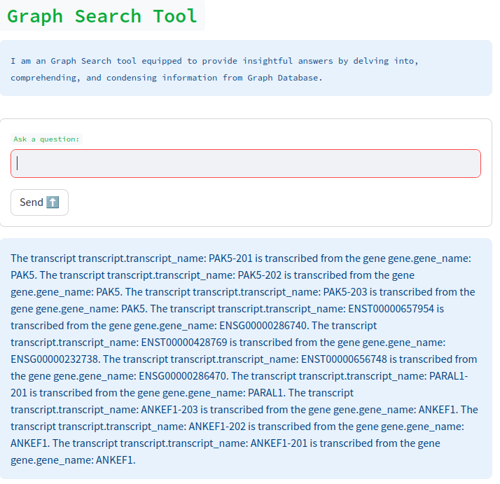

# Graph Search Chatbot

This project is a chatbot application that integrates a Neo4j graph database with Langchain's GraphCypherQAChain and Google's Gemini (Generative AI) model. The chatbot is capable of querying a knowledge graph (Neo4j) to provide insightful answers to complex questions about the relationships between entities like genes, transcripts, and proteins.
Features

#### Graph Database: 
Uses Neo4j to store and manage graph-based data.
#### Graph Querying: 
Utilizes Langchain's GraphCypherQAChain to generate and execute Cypher queries on the Neo4j database.
#### Natural Language Processing: 
Uses Google's Gemini model to generate and format responses in natural language.
#### Streamlit Web App: 
Interactive web interface built with Streamlit for real-time chat and querying.

## Demo

Below is a screenshot of the chatbot in action:

## Installation
### Clone the repository:
    git clone https://github.com/IbnuEyni/langchaingraphqa.git
    cd langchaingraphqa
### Install the required dependencies:
    pip install -r requirements.txt
### Set up environment variables: Create a .env file in the root directory and include your Google API key and Neo4j credentials:
    GOOGLE_API_KEY=your_google_api_key
    NEO4J_URI=your_neo4j_uri
    NEO4J_USERNAME=your_neo4j_username
    NEO4J_PASSWORD=your_neo4j_password

## Usage

To run the chatbot, execute the following command:
    streamlit run app.py
This will launch the Streamlit web interface where you can input your questions and receive answers based on the Neo4j graph data.

## How It Works

#### Neo4j Graph Database: 
The chatbot queries the graph database to find relationships between nodes (e.g., genes, transcripts).
#### Langchain's GraphCypherQAChain: 
Converts natural language questions into Cypher queries that interact with the Neo4j database.
#### Google's Gemini AI Model: 
Interprets and generates natural language responses from the graph query results.

## File Structure

#### app.py: 
The main Streamlit app that handles user input, generates responses, and displays results.
#### utils.py: 
Utility functions for handling the query logic.
#### .env: 
Contains the environment variables required to connect to Google’s API and Neo4j.
#### app.log: 
Log file to record interactions and errors.

## Example

#### Ask the chatbot a question like:

    What is the gene transcribed to transcript X?

The chatbot will query the Neo4j database for relevant information and return an insightful, natural-language answer.